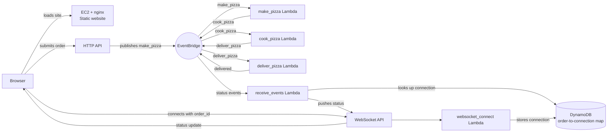

# Pizza Tracking

This project provisions a small AWS lab environment for hosting a pizza-tracking web application. The infrastructure is defined in [pizza-tracking-template.yml](pizza-tracking-template.yml), and the deployable Angular application is in [website/](website/).

The application foundation stack creates the EventBridge bus, Lambda functions, EventBridge rules, HTTP API, WebSocket API, IAM roles, and DynamoDB connection table. The separate webserver stack creates the public EC2/nginx host and installs the customized Fireline Pizza frontend.

> Please refer to my post here for more info: [Serverless Pizza](https://www.tech-learning-hub.com/project/serverless-pizza/)

## Architecture



### Stack ownership

- **Application foundation** (`pizza-tracking-template.yml`): EventBridge bus, IAM roles, `websocket_connections`, and exported API/EventBridge values.
- **Webserver** (`webserver-template.yml`): `LabVPC`, public subnet/routing, HTTP security group, EC2/nginx, SSM instance profile, S3 UI download, and generated `runtime-config.js`.
- **External dependency**: an S3 bucket containing the Lambda deployment ZIP and website deployment ZIP.

## EC2 bootstrap and nginx

The `WebInstance.UserData` in `webserver-template.yml` runs during the first boot:

1. Updates Amazon Linux packages with `dnf -y update`.
2. Installs nginx and unzip.
3. Downloads the customized archive from `s3://${WebsiteArtifactBucket}/${WebsiteArtifactKey}` using `aws s3 cp`.
4. Extracts the archive into `/usr/share/nginx/html`.
5. Writes `runtime-config.js` with the HTTP and WebSocket API URLs.
6. Sets nginx ownership and enables and starts nginx.

UserData logs to `/var/log/pizza-tracking-user-data.log`. It uses the nginx package's default server configuration; it does not create a custom virtual host or reverse proxy. The selected AMI must provide the AWS CLI because UserData uses `aws s3 cp` but does not install the CLI. Nginx serves the static frontend over HTTP port 80; it does not run the Angular application server or implement the pizza workflow. The browser executes the JavaScript bundles after nginx returns `index.html` and its referenced assets.

The deployed page presents a pizza menu, order summary, live kitchen timeline, and event log. It uses the runtime API configuration generated by CloudFormation rather than asking the customer to paste endpoint URLs. The original Angular bundle remains in the website archive, but the page surface is replaced by the Fireline Pizza experience in `index.html`.

## Frontend workflow

When **Start my order** is selected, the app:

1. Generates a small order identifier such as `1AB` through `5AB`.
2. Builds this JSON request body:

   ```json
   {
     "item": {
       "order_id": "1AB",
       "eventtype": "make_pizza"
     }
   }
   ```

3. Opens the WebSocket using `?order_id=<order_id>` if one is not already open.
4. Sends the request body to the API URL with an HTTP POST.
5. Displays the order number and appends JSON status updates received from the WebSocket to the kitchen timeline.

### Runtime endpoint configuration

The static frontend cannot discover companion API Gateway URLs from nginx by itself. The CloudFormation template solves this without exposing endpoint fields in the UI:

- `HttpApiInvokeUrl` is the companion `lab_http_api` Invoke URL.
- `WebSocketApiUrl` is the companion `lab_websocket_api` WebSocket URL.
- EC2 UserData writes both values to `/usr/share/nginx/html/runtime-config.js` as `window.PIZZA_CONFIG`.
- `index.html` loads that file before starting the pizza-ordering client.

Provide the values to `webserver-template.yml` during the webserver deployment. The UI uses them automatically and appends `?order_id=<order_id>` to the WebSocket URL for each order. If either value is missing, the order button reports that the deployment is not configured.

The backend flow is API Gateway -> EventBridge -> pizza-processing Lambdas. Event notifications can be delivered back through the WebSocket API; the connection and event-receiving Lambdas use the `websocket_connections` table to associate an `order_id` with a connection.

## Lambda implementation

The Lambda handlers are JavaScript ES modules using the AWS SDK for JavaScript v3:

| Source file | Responsibility | Input and output |
| --- | --- | --- |
| `make-pizza.js` | Receives the initial `make_pizza` event and publishes the next stage. | Reads `event.detail`, changes `detail.item.eventtype` to `cook_pizza`, and publishes it to the EventBridge bus in `EVENT_BUS` with source `make_pizza`. |
| `cook-pizza.js` | Advances the order from cooking to delivery. | Changes `event.detail.item.eventtype` to `deliver_pizza` and publishes to `EVENT_BUS` with source `cook_pizza`. |
| `deliver-pizza.js` | Completes the pizza workflow. | Changes `detail.item.eventtype` to `delivered` and publishes to `EVENT_BUS` with source `deliver_pizza`. |
| `websocket_connect.js` | Records a WebSocket connection for an order. | Reads `queryStringParameters.order_id` and `requestContext.connectionId`, then writes both to the DynamoDB table named by `TABLENAME`. |
| `receive-events.js` | Sends EventBridge status events to the browser. | Reads `event.detail.item.order_id`, looks up the connection in `TABLENAME`, and calls API Gateway Management API at `APIGW_ENDPOINT`. |

### Event progression

The three pizza-stage functions preserve the same event object, wait three seconds to make the kitchen progression visible, and mutate only `detail.item.eventtype` before republishing it:

```text
make_pizza -> cook_pizza -> deliver_pizza -> delivered
```

The EventBridge rules must route each source/event type to the correct next Lambda and route the status events to `receive-events.js`. The WebSocket connect route must invoke `websocket_connect.js` with an `order_id` query parameter before the first status event is emitted.

### Lambda configuration

Each function is created by `pizza-tracking-template.yml` from the S3 deployment ZIP supplied through `LambdaArtifactsBucket` and `LambdaArtifactsKey`:

| Function | Handler | Required environment variables |
| --- | --- | --- |
| Make pizza | `make-pizza.handler` | `EVENT_BUS` |
| Cook pizza | `cook-pizza.handler` | `EVENT_BUS` |
| Deliver pizza | `deliver-pizza.handler` | `EVENT_BUS` |
| WebSocket connect | `websocket_connect.handler` | `TABLENAME` |
| Receive events | `receive-events.handler` | `TABLENAME`, `APIGW_ENDPOINT` |

`APIGW_ENDPOINT` must be the deployed WebSocket API management endpoint, normally the HTTPS endpoint for the API Gateway stage, for example `https://<api-id>.execute-api.<region>.amazonaws.com/<stage>`. It is the endpoint used by `PostToConnection`, not the browser's `wss://` URL.

Because the source uses `import` statements, deploy it as an ES module. Use either a `package.json` containing `"type": "module"` or `.mjs` file extensions. The deployment package must also include the imported AWS SDK v3 packages, unless the selected Lambda runtime already provides the exact packages and versions required by the application. Installing them into the function package is the portable option:

```bash
npm install @aws-sdk/client-eventbridge \
  @aws-sdk/client-dynamodb \
  @aws-sdk/lib-dynamodb \
  @aws-sdk/client-apigatewaymanagementapi
```

The IAM permissions must match the code: the three pizza functions need `events:PutEvents` on `lab_event_bus`, `websocket_connect.js` needs DynamoDB `PutItem`, and `receive-events.js` needs DynamoDB `GetItem` plus `execute-api:ManageConnections` and `execute-api:Invoke` for the WebSocket API connection resource. The CloudFormation template's roles contain these permissions, but the function deployment must actually associate each function with the corresponding role.

## Deployment

### Recommended split deployment

Deploy the application stack first, then deploy the separate webserver. This ordering means the webserver receives the generated API URLs during its first boot.

1. Upload the Lambda deployment ZIP to an S3 bucket.
2. `pizza-tracking-template.yml` creates the complete application plane: EventBridge bus, Lambda functions, EventBridge rules, HTTP/WebSocket APIs, IAM roles, the WebSocket connection table, and API URL outputs.
3. Upload `website-deploy.zip` to an S3 bucket in the target account.
4. `webserver-template.yml` creates the VPC, public subnet, EC2/nginx host, and installs the customized UI with the API URLs supplied as parameters.

### Prerequisites

- AWS CLI configured for the target account and Region.
- Permission to create named IAM roles, DynamoDB, VPC, EC2, S3, and CloudFormation resources.
- The Node.js Lambda functions, EventBridge bus/rules, and API Gateway APIs deployed or ready to deploy.
- The customized website archive containing the contents of `website/website`.
- The Lambda deployment ZIP containing all five handlers, `package.json` with `"type": "module"`, and the AWS SDK dependencies.

Set the target-account S3 bucket before starting Step 1:

```powershell
$AccountId = aws sts get-caller-identity --query Account --output text
$Bucket = "pizza-tracking-website-$AccountId"
$Region = "us-west-1"
```

### Step 1: Deploy the application foundation

Build and upload the Lambda artifact before deploying the application stack:

```powershell
$LambdaBuild = "$PWD\lambda-build"
Remove-Item $LambdaBuild -Recurse -Force -ErrorAction SilentlyContinue
New-Item -ItemType Directory $LambdaBuild | Out-Null
Copy-Item make-pizza.js,cook-pizza.js,deliver-pizza.js,websocket_connect.js,receive-events.js $LambdaBuild
Push-Location $LambdaBuild
npm init -y
npm pkg set type=module
npm install @aws-sdk/client-eventbridge @aws-sdk/client-dynamodb @aws-sdk/lib-dynamodb @aws-sdk/client-apigatewaymanagementapi
Compress-Archive -Path * -DestinationPath ..\lambda-package.zip -Force
Pop-Location
aws s3 cp ./lambda-package.zip "s3://$Bucket/pizza-tracking/lambda-package.zip"
```

```powershell
aws cloudformation deploy `
  --template-file pizza-tracking-template.yml `
  --stack-name pizza-tracking-app `
  --region us-west-1 `
  --capabilities CAPABILITY_NAMED_IAM `
  --parameter-overrides `
    EventBusName=lab_event_bus `
    TableName=websocket_connections `
    LambdaArtifactsBucket=$Bucket `
    LambdaArtifactsKey=pizza-tracking/lambda-package.zip
```

Record the `HttpApiInvokeUrl`, `WebSocketApiUrl`, `EventBusARN`, and `TableName` outputs. Pass the API URL outputs to the webserver stack.

Get the outputs:

```powershell
aws cloudformation describe-stacks `
  --stack-name pizza-tracking-app `
  --region $Region `
  --query "Stacks[0].Outputs"
```

$WebSocketApiUrl="wss://1pxb61hg44.execute-api.us-west-1.amazonaws.com/production"
$HttpApiInvokeUrl="https://e7y8hg5eib.execute-api.us-west-1.amazonaws.com"

### Step 2: Upload the website

```powershell
Compress-Archive -Path ".\website\*" -DestinationPath ".\website-deploy.zip" -Force
aws s3 cp ./website-deploy.zip "s3://$Bucket/pizza-tracking/website-deploy.zip"
```

The archive should contain `index.html`, the compiled assets, and the custom Fireline Pizza UI. The webserver UserData creates `runtime-config.js`; do not add endpoint values to the archive.

The application stack outputs the API URLs. Replace the placeholders in Step 4 with those output values.

### Step 3: Deploy the webserver

```powershell
aws cloudformation deploy `
  --template-file webserver-template.yml `
  --stack-name pizza-tracking-web `
  --region $Region `
  --capabilities CAPABILITY_NAMED_IAM `
  --parameter-overrides `
    InstanceType=t3.micro `
    HttpApiInvokeUrl=$HttpApiInvokeUrl `
    WebSocketApiUrl=$WebSocketApiUrl `
    WebsiteArtifactBucket=$Bucket `
    WebsiteArtifactKey=pizza-tracking/website-deploy.zip
```

`webserver-template.yml` uses the EC2 instance role to download the S3 archive, writes `/usr/share/nginx/html/runtime-config.js`, installs nginx, and starts the site. Retrieve the web address with:

```powershell
aws cloudformation describe-stacks `
  --stack-name pizza-tracking-web `
  --query "Stacks[0].Outputs[?OutputKey=='WebServerIP'].OutputValue" `
  --output text
```

Open `http://<WebServerIP>/` after UserData completes.

## Outputs

| Output | Description |
| --- | --- |
| `APIExecutionRoleARN` | ARN from the application foundation stack for the API Gateway EventBridge integration. |
| `EventBusARN` | ARN of the application EventBridge bus. |
| `TableName` | DynamoDB table used for WebSocket connection tracking. |
| `WebServerIP` | Public IPv4 address from the webserver stack. |

## Operations and troubleshooting

- Check UserData output in `/var/log/pizza-tracking-user-data.log` on the instance. If the `aws s3 cp` command is not found, the selected AMI does not have the AWS CLI required by the bootstrap script.
- Check nginx service state with `sudo systemctl status nginx`.
- Validate nginx configuration with `sudo nginx -t`.
- Inspect nginx access and error logs in `/var/log/nginx/`.
- Confirm the extracted frontend exists at `/usr/share/nginx/html`.
- If the page loads but ordering fails, verify that the API and WebSocket URLs were copied from the companion API Gateway resources and that their integrations, routes, permissions, and EventBridge rules exist.
- The template exposes HTTP on port 80 only. HTTPS termination, a domain name, TLS certificates, and a reverse proxy are not configured.

## Cleanup

Delete both stacks when the lab is complete. Delete the webserver first, then the application foundation:

```bash
aws cloudformation delete-stack --stack-name pizza-tracking-web
aws cloudformation delete-stack --stack-name pizza-tracking-app
```

The webserver stack removes the nested security-group stack, EC2 instance, and networking resources. The application stack removes IAM roles and the DynamoDB table. Verify both deletions completed successfully.
