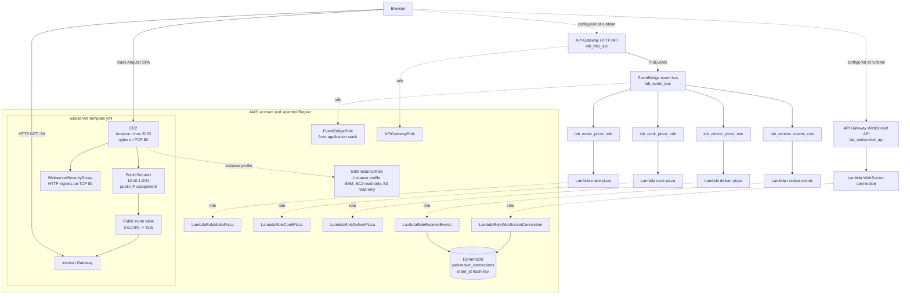

# Pizza Tracking

This project provisions a small AWS lab environment for hosting a pizza-tracking web application. The infrastructure is defined in [pizza-tracking-template.yml](pizza-tracking-template.yml), and the deployable Angular application is in [website/website](website/website).

The application foundation stack creates the EventBridge bus, Lambda functions, EventBridge rules, HTTP API, WebSocket API, IAM roles, and DynamoDB connection table. The separate webserver stack creates the public EC2/nginx host and installs the customized Fireline Pizza frontend.

> The application template creates the application services from the Lambda deployment ZIP. The webserver template remains separate and consumes the API URL outputs.

## Architecture



### Stack ownership

- **Application foundation** (`pizza-tracking-template.yml`): EventBridge bus, IAM roles, `websocket_connections`, and exported API/EventBridge values.
- **Webserver** (`webserver-template.yml`): `LabVPC`, public subnet/routing, HTTP security group, EC2/nginx, SSM instance profile, S3 UI download, and generated `runtime-config.js`.
- **External dependency**: an S3 bucket containing the Lambda deployment ZIP and website deployment ZIP.

## EC2 bootstrap and nginx

The `WebInstance.UserData` in `webserver-template.yml` runs during the first boot:

1. Updates Amazon Linux packages with `dnf -y update`.
2. Installs nginx and unzip.
3. Downloads the customized archive from `s3://${WebsiteArtifactBucket}/${WebsiteArtifactKey}` using `aws s3 cp`.
4. Extracts the archive into `/usr/share/nginx/html`.
5. Writes `runtime-config.js` with the HTTP and WebSocket API URLs.
6. Sets nginx ownership and enables and starts nginx.

UserData logs to `/var/log/pizza-tracking-user-data.log`. It uses the nginx package's default server configuration; it does not create a custom virtual host or reverse proxy. The selected AMI must provide the AWS CLI because UserData uses `aws s3 cp` but does not install the CLI. Nginx serves the static frontend over HTTP port 80; it does not run the Angular application server or implement the pizza workflow. The browser executes the JavaScript bundles after nginx returns `index.html` and its referenced assets.

The deployed page presents a pizza menu, order summary, live kitchen timeline, and event log. It uses the runtime API configuration generated by CloudFormation rather than asking the customer to paste endpoint URLs. The original Angular bundle remains in the website archive, but the page surface is replaced by the Fireline Pizza experience in `index.html`.

## Frontend workflow

When **Start my order** is selected, the app:

1. Generates a small order identifier such as `1AB` through `5AB`.
2. Builds this JSON request body:

   ```json
   {
     "item": {
       "order_id": "1AB",
       "eventtype": "make_pizza"
     }
   }
   ```

3. Opens the WebSocket using `?order_id=<order_id>` if one is not already open.
4. Sends the request body to the API URL with an HTTP POST.
5. Displays the order number and appends JSON status updates received from the WebSocket to the kitchen timeline.

### Runtime endpoint configuration

The static frontend cannot discover companion API Gateway URLs from nginx by itself. The CloudFormation template solves this without exposing endpoint fields in the UI:

- `HttpApiInvokeUrl` is the companion `lab_http_api` Invoke URL.
- `WebSocketApiUrl` is the companion `lab_websocket_api` WebSocket URL.
- EC2 UserData writes both values to `/usr/share/nginx/html/runtime-config.js` as `window.PIZZA_CONFIG`.
- `index.html` loads that file before starting the pizza-ordering client.

Provide the values to `webserver-template.yml` during the webserver deployment. The UI uses them automatically and appends `?order_id=<order_id>` to the WebSocket URL for each order. If either value is missing, the order button reports that the deployment is not configured.

The backend flow is API Gateway -> EventBridge -> pizza-processing Lambdas. Event notifications can be delivered back through the WebSocket API; the connection and event-receiving Lambdas use the `websocket_connections` table to associate an `order_id` with a connection.

## Lambda implementation

The Lambda handlers are JavaScript ES modules using the AWS SDK for JavaScript v3:

| Source file | Responsibility | Input and output |
| --- | --- | --- |
| `make-pizza.js` | Receives the initial `make_pizza` event and publishes the next stage. | Reads `event.detail`, changes `detail.item.eventtype` to `cook_pizza`, and publishes it to the EventBridge bus in `EVENT_BUS` with source `make_pizza`. |
| `cook-pizza.js` | Advances the order from cooking to delivery. | Changes `event.detail.item.eventtype` to `deliver_pizza` and publishes to `EVENT_BUS` with source `cook_pizza`. |
| `deliver-pizza.js` | Completes the pizza workflow. | Changes `detail.item.eventtype` to `delivered` and publishes to `EVENT_BUS` with source `deliver_pizza`. |
| `websocket_connect.js` | Records a WebSocket connection for an order. | Reads `queryStringParameters.order_id` and `requestContext.connectionId`, then writes both to the DynamoDB table named by `TABLENAME`. |
| `receive-events.js` | Sends EventBridge status events to the browser. | Reads `event.detail.item.order_id`, looks up the connection in `TABLENAME`, and calls API Gateway Management API at `APIGW_ENDPOINT`. |

### Event progression

The three pizza-stage functions preserve the same event object, wait three seconds to make the kitchen progression visible, and mutate only `detail.item.eventtype` before republishing it:

```text
make_pizza -> cook_pizza -> deliver_pizza -> delivered
```

The EventBridge rules must route each source/event type to the correct next Lambda and route the status events to `receive-events.js`. The WebSocket connect route must invoke `websocket_connect.js` with an `order_id` query parameter before the first status event is emitted.

### Lambda configuration

Each function is created by `pizza-tracking-template.yml` from the S3 deployment ZIP supplied through `LambdaArtifactsBucket` and `LambdaArtifactsKey`:

| Function | Handler | Required environment variables |
| --- | --- | --- |
| Make pizza | `make-pizza.handler` | `EVENT_BUS` |
| Cook pizza | `cook-pizza.handler` | `EVENT_BUS` |
| Deliver pizza | `deliver-pizza.handler` | `EVENT_BUS` |
| WebSocket connect | `websocket_connect.handler` | `TABLENAME` |
| Receive events | `receive-events.handler` | `TABLENAME`, `APIGW_ENDPOINT` |

`APIGW_ENDPOINT` must be the deployed WebSocket API management endpoint, normally the HTTPS endpoint for the API Gateway stage, for example `https://<api-id>.execute-api.<region>.amazonaws.com/<stage>`. It is the endpoint used by `PostToConnection`, not the browser's `wss://` URL.

Because the source uses `import` statements, deploy it as an ES module. Use either a `package.json` containing `"type": "module"` or `.mjs` file extensions. The deployment package must also include the imported AWS SDK v3 packages, unless the selected Lambda runtime already provides the exact packages and versions required by the application. Installing them into the function package is the portable option:

```bash
npm install @aws-sdk/client-eventbridge \
  @aws-sdk/client-dynamodb \
  @aws-sdk/lib-dynamodb \
  @aws-sdk/client-apigatewaymanagementapi
```

The IAM permissions must match the code: the three pizza functions need `events:PutEvents` on `lab_event_bus`, `websocket_connect.js` needs DynamoDB `PutItem`, and `receive-events.js` needs DynamoDB `GetItem` plus `execute-api:ManageConnections` and `execute-api:Invoke` for the WebSocket API connection resource. The CloudFormation template's roles contain these permissions, but the function deployment must actually associate each function with the corresponding role.

## Deployment

### Recommended split deployment

Deploy the application stack first, then deploy the separate webserver. This ordering means the webserver receives the generated API URLs during its first boot.

1. Upload the Lambda deployment ZIP to an S3 bucket.
2. `pizza-tracking-template.yml` creates the complete application plane: EventBridge bus, Lambda functions, EventBridge rules, HTTP/WebSocket APIs, IAM roles, the WebSocket connection table, and API URL outputs.
3. Upload `website-deploy.zip` to an S3 bucket in the target account.
4. `webserver-template.yml` creates the VPC, public subnet, EC2/nginx host, and installs the customized UI with the API URLs supplied as parameters.

### Prerequisites

- AWS CLI configured for the target account and Region.
- Permission to create named IAM roles, DynamoDB, VPC, EC2, S3, and CloudFormation resources.
- The Node.js Lambda functions, EventBridge bus/rules, and API Gateway APIs deployed or ready to deploy.
- The customized website archive containing the contents of `website/website`.
- The Lambda deployment ZIP containing all five handlers, `package.json` with `"type": "module"`, and the AWS SDK dependencies.

Set the target-account S3 bucket before starting Step 1:

```powershell
$AccountId = aws sts get-caller-identity --query Account --output text
$Bucket = "pizza-tracking-website-$AccountId"
$Region = "us-west-1"
```

### Step 1: Deploy the application foundation

Build and upload the Lambda artifact before deploying the application stack:

```powershell
$LambdaBuild = "$PWD\lambda-build"
Remove-Item $LambdaBuild -Recurse -Force -ErrorAction SilentlyContinue
New-Item -ItemType Directory $LambdaBuild | Out-Null
Copy-Item make-pizza.js,cook-pizza.js,deliver-pizza.js,websocket_connect.js,receive-events.js $LambdaBuild
Push-Location $LambdaBuild
npm init -y
npm pkg set type=module
npm install @aws-sdk/client-eventbridge @aws-sdk/client-dynamodb @aws-sdk/lib-dynamodb @aws-sdk/client-apigatewaymanagementapi
Compress-Archive -Path * -DestinationPath ..\lambda-package.zip -Force
Pop-Location
aws s3 cp ./lambda-package.zip "s3://$Bucket/pizza-tracking/lambda-package.zip"
```

```powershell
aws cloudformation deploy `
  --template-file pizza-tracking-template.yml `
  --stack-name pizza-tracking-app `
  --region us-west-1 `
  --capabilities CAPABILITY_NAMED_IAM `
  --parameter-overrides `
    EventBusName=lab_event_bus `
    TableName=websocket_connections `
    LambdaArtifactsBucket=$Bucket `
    LambdaArtifactsKey=pizza-tracking/lambda-package.zip
```

Record the `HttpApiInvokeUrl`, `WebSocketApiUrl`, `EventBusARN`, and `TableName` outputs. Pass the API URL outputs to the webserver stack.

Get the outputs:

```powershell
aws cloudformation describe-stacks `
  --stack-name pizza-tracking-app `
  --region $Region `
  --query "Stacks[0].Outputs"
```

$WebSocketApiUrl="wss://1pxb61hg44.execute-api.us-west-1.amazonaws.com/production"
$HttpApiInvokeUrl="https://e7y8hg5eib.execute-api.us-west-1.amazonaws.com"

### Step 2: Upload the website

```powershell
Compress-Archive -Path ".\website\*" -DestinationPath ".\website-deploy.zip" -Force
aws s3 cp ./website-deploy.zip "s3://$Bucket/pizza-tracking/website-deploy.zip"
```

The archive should contain `index.html`, the compiled assets, and the custom Fireline Pizza UI. The webserver UserData creates `runtime-config.js`; do not add endpoint values to the archive.

The application stack outputs the API URLs. Replace the placeholders in Step 4 with those output values.

### Step 4: Deploy the webserver

```powershell
aws cloudformation deploy `
  --template-file webserver-template.yml `
  --stack-name pizza-tracking-web `
  --region $Region `
  --capabilities CAPABILITY_NAMED_IAM `
  --parameter-overrides `
    InstanceType=t3.micro `
    HttpApiInvokeUrl=$HttpApiInvokeUrl `
    WebSocketApiUrl=$WebSocketApiUrl `
    WebsiteArtifactBucket=$Bucket `
    WebsiteArtifactKey=pizza-tracking/website-deploy.zip
```

`webserver-template.yml` uses the EC2 instance role to download the S3 archive, writes `/usr/share/nginx/html/runtime-config.js`, installs nginx, and starts the site. Retrieve the web address with:

```powershell
aws cloudformation describe-stacks `
  --stack-name pizza-tracking-web `
  --query "Stacks[0].Outputs[?OutputKey=='WebServerIP'].OutputValue" `
  --output text
```

Open `http://<WebServerIP>/` after UserData completes.

### Troubleshooting:

aws ssm start-session `
  --target i-003f7dce812c4b878 `
  --region us-west-1

cat /var/log/pizza-tracking-user-data.log

ls -la /usr/share/nginx/html/

systemctl status nginx

## Outputs

| Output | Description |
| --- | --- |
| `APIExecutionRoleARN` | ARN from the application foundation stack for the API Gateway EventBridge integration. |
| `EventBusARN` | ARN of the application EventBridge bus. |
| `TableName` | DynamoDB table used for WebSocket connection tracking. |
| `WebServerIP` | Public IPv4 address from the webserver stack. |

## Configure EventBridge

The application stack creates the bus and rules automatically. The following section is for verification and reference; do not recreate these rules manually after Step 1 unless you are troubleshooting or intentionally deploying them outside CloudFormation.
The application stack creates the EventBridge bus and all four rules. Use this section to verify their patterns and targets. The rules use nested event patterns because `eventtype` is inside `detail.item`. The receive-events rule intentionally overlaps the stage rules: for each stage event, EventBridge invokes both the stage Lambda and `receive-events.js`, so the browser receives the current status while the order advances.

The required bus and rule configuration is:

| Resource | Event pattern | Lambda target |
| --- | --- | --- |
| `lab_event_bus` | Custom event bus | None |
| `lab_make_pizza_rule` | `detail.item.eventtype`: `make_pizza` | `make-pizza.handler` |
| `lab_cook_pizza_rule` | `detail.item.eventtype`: `cook_pizza` | `cook-pizza.handler` |
| `lab_deliver_pizza_rule` | `detail.item.eventtype`: `deliver_pizza` | `deliver-pizza.handler` |
| `lab_receive_events_rule` | `detail.item.eventtype`: `make_pizza`, `cook_pizza`, `deliver_pizza`, `delivered` | `receive-events.handler` |

The final `delivered` value is required in `lab_receive_events_rule`; `deliver-pizza.js` publishes that value after it receives `deliver_pizza`.

The first rule that is created invokes the make_pizza lab function. This rule is configured to match a request body that includes an attribute called eventtype with the value make_pizza. It is also important to note that the rule needs to match the nesting of the eventtype attribute, not just the value.

At the top of the AWS Management Console, in the search bar, search for and choose Amazon EventBridge.

From the left-hand navigation pane of the EventBridge console, under the Buses section, choose Event buses and verify that `lab_event_bus` exists. The application stack creates it and exports its ARN as `EventBusARN`.

From the left-hand navigation pane of the EventBridge console, under the Buses section, choose Rules then select Create rule .

Select Advanced Builder

Configure the rule with the following settings and select Next .

For Name enter: lab_make_pizza_rule
For Event bus select: lab_event_bus
You can either choose an AWS service as an event source or create a custom event pattern for your own application. In this case you are going to create a custom event pattern.

On the Build event pattern screen, under the Creation method section, select  Custom pattern (JSON editor) for the Method. This enables the pattern editor, allowing you to paste in a custom pattern.

Copy and paste the following json object into the Event pattern editor, you can use the {} Prettify option to make the snippet easier to read. Select Next when you are finished.


{
  "detail": {
    "item": {
      "eventtype": ["make_pizza"]
    }
  }
}
In the Select target(s) page, configure the following information:
Target types: Select AWS service
Select a target: Select Lambda function from the dropdown menu
Function: Select the deployed `make-pizza` Lambda function from the dropdown menu.
Permissions: Uncheck Use execution role (recommended) option.
Select Next and select Next again on the Configure tags - optional screen.

On the Review and create screen, select Create rule.

 Expected service output:

 Rule lab_make_pizza_rule was created successfully


 Note: To view the rules that you have created, choose lab_event_bus from the Event bus dropdown list on the Rules screen.

Create the rule to invoke the cook_pizza Lambda function. This rule is configured to match a request body that includes an attribute called eventtype with the value cook_pizza.

From the left-hand navigation pane under Buses, choose Rules then select Create rule . Configure the rule with the following settings and select Next .

For Name enter: lab_cook_pizza_rule
For Event bus select: lab_event_bus
On the Build event pattern screen, under the Creation method section, choose  Custom patterns (JSON editor) for the Method.

Copy and paste the following json object into the Event pattern editor. Select Next when you are finished.


{
  "detail": {
    "item": {
      "eventtype": ["cook_pizza"]
    }
  }
}
In the Select target(s) page, configure the following information:
Target types: Select AWS service
Select a target: Select Lambda function from the dropdown menu
Function: Select the deployed `cook-pizza` Lambda function from the dropdown menu.
Permissions: Uncheck Use execution role (recommended) option.
Select Next and select Next again on the Configure tags - optional screen.

On the Review and create screen, select Create rule .

 Expected service output:

 Rule lab_cook_pizza_rule was created successfully


Create the rule to invoke the deliver_pizza Lambda function. This rule is configured to match a request body that includes an attribute called eventtype with the value deliver_pizza.

From the left-hand navigation pane under Buses, choose Rules then select Create rule . Configure the rule with the following settings and select Next .

For Name enter: lab_deliver_pizza_rule
For Event bus select: lab_event_bus
On the Build event pattern screen, under the Creation method section, choose  Custom patterns (JSON editor) for the Method.

Copy and paste the following json object into the Event pattern editor. Select Next when you are finished.


{
  "detail": {
    "item": {
      "eventtype": ["deliver_pizza"]
    }
  }
}
In the Select target(s) page, configure the following information:
Target types: Select AWS service
Select a target: Select Lambda function from the dropdown menu
Function: Select the deployed `deliver-pizza` Lambda function from the dropdown menu.
Permissions: Uncheck Use execution role (recommended) option.
Select Next and select Next again on the Configure tags - optional screen.

On the Review and create screen, select Create rule .

 Expected service output:

 Rule lab_deliver_pizza_rule was created successfully


Create the final rule to track every pizza status and invoke the `receive-events` Lambda function. Since this pattern overlaps the three stage rules, two Lambda functions are invoked for `make_pizza`, `cook_pizza`, and `deliver_pizza`: the stage Lambda advances the order and `receive-events` sends the current event to the browser. The `delivered` event is handled only by `receive-events`.

From the left-hand navigation pane under Buses, choose Rules then select Create rule . Configure the rule with the following settings and select Next .

For Name enter: lab_receive_events_rule
For Event bus select: lab_event_bus
On the Build event pattern screen, under the Creation method sections, choose  Custom patterns (JSON editor) for the Method.

Copy and paste the following json object into the Event pattern editor. Select Next when you are finished.


{
  "detail": {
    "item": {
      "eventtype": ["make_pizza","cook_pizza","deliver_pizza","delivered"]
    }
  }
}
In the Select target(s) page, configure the following information:
Target types: Select AWS service
Select a target: Select Lambda function from the dropdown menu
Function: Select the deployed `receive-events` Lambda function from the dropdown menu.
Permissions: Uncheck Use execution role (recommended) option.
Select Next and select Next again on the Configure tags - optional screen.

On the Review and create screen, select Create rule .

 Expected service output:

 Rule lab_receive_events_rule was created successfully

### EventBridge target permissions

When a Lambda function is added as an EventBridge target, EventBridge must be allowed to invoke it. If the console does not create the permission automatically, add an equivalent resource-based permission to each target Lambda for principal `events.amazonaws.com`, scoped to the corresponding rule ARN. The `EventBridgeRole` in the CloudFormation template is for API destinations and does not replace Lambda invoke permissions.

## Configure API Gateway

Here create and configure an HTTP API endpoint to integrate with EventBridge. Requests sent to the API by the web application redirects to the event bus, where the request body matches to a rule, and a target function invoked. You also create a web socket endpoint, which allows the client application to establish a persistent connection. This connection receives and then displays events in the browser as they occur.

REST APIs and HTTP APIs are both RESTful API products. REST APIs support more features than HTTP APIs, while HTTP APIs are designed with minimal features so that they can be offered at a lower price. You can use HTTP APIs to send requests to Lambda functions or other AWS Services, such as EventBridge.

At the top of the AWS Management Console, in the search bar, search for and choose API Gateway.

Click on Create an API

In the Choose an API type select Build from the HTTP API section.

In the API Name field, enter lab_http_api

Select Next until you get to the Review and Create screen, then choose Create .

 Expected service output: Your identifier at the end differs from this example.

 Successfully created API lab_http_api (dr8sknw1gk)


Under the Develop section in the left-hand navigation pane, select Routes, then choose Create .

Select POST from the drop-down list, and select Create .

Under the Develop select Integrations, choose the POST route link and then select Create and attach an integration .

For Integration target, configure the following options.

For Integration type, select: Amazon EventBridge
For Integration action, select: PutEvents
For EventBridge - PutEvents, configure the following options.

For Detail, enter: $request.body
For Detail type, enter: eventtype
For Source, enter: lab_http_api
For Invocation role, copy the APIExecutionRoleARN from the left side of the instructions pane.
Expand Advanced settings, and configure the remaining fields. Select Create when you are finished.

For Event bus name - optional, enter the event bus ARN you saved in Task 2.
For Region - optional, copy the AWSRegion from the left side of the instructions pane.
From the left-hand navigation pane, select CORS and choose Configure in the top right corner.

For Access-Control-Allow-Origin enter *.

Next to Access-Control-Allow-Origin, choose Add

For Access-Control-Allow-Methods select, POST.

For Access-Control-Allow-Headers, enter *.

Next to Access-Control-Allow-Headers, choose Add

Choose Save .

From the navigation menu on the left-hand side of the screen, navigate to the endpoint details screen by selecting API: lab_http_api. Copy and save the Invoke URL from the Stages for lab_http_api section of the `lab_http_api` screen. The URL is needed in the frontend workflow.

Now create the web socket API endpoint, which is used to send events back to the web application. Web socket connections are two-way persistent connections allowing bi-directional communication and are often used by chat applications.

At the top of the left-hand navigation pane, select APIs, then select Create API .

In the Choose an API type select Build from the WebSocket API section.

Configure the following fields and select Next .

For the API Name field, enter lab_websocket_api
For Route selection expression, enter request.body.action
On the Add routes page choose Add $connect route and select Next .

The websocket_connect function invokes when the application establishes the connection. This function saves the connection ID to a DynamoDB table.

For Integration type, choose Lambda.

For Lambda function, choose the deployed `websocket_connect` function. Its configured handler must be `websocket_connect.handler`.

Select Next .

On the Add Stages page select Next, followed by Create and deploy .

Select Stages from the left-hand navigation page and choose the Production stage.

Copy and save the WebSocket URL, as it is needed shortly. The frontend appends `?order_id=<order_id>` when it opens the connection, so the `$connect` route must be enabled and must receive that query-string parameter.

Copy the Connection URL up to, but do not include the @connections text.

Navigate back to the Lambda console and open the deployed `receive-events` Lambda function. Its configured handler must be `receive-events.handler`; the Lambda console function name may use `receive_events` if that is how it was created, but the handler filename/export must match the source file.

On the configuration tab select Environment variables, choose Edit and select Add environment variable.

Configure the variable with the following settings, and select Save when you are finished.

For Key, enter: APIGW_ENDPOINT
For Value, enter: the copied Connection URL without the `@connections` suffix, for example `https://<api-id>.execute-api.<region>.amazonaws.com/Production`.
 Expected service output:

 Successfully updated the function receive_events.

### API Gateway verification

Before testing the browser, verify the following contracts:

- The HTTP API `POST /` route uses the EventBridge `PutEvents` action and the `lab_event_bus` ARN, with the API Gateway execution role exported as `APIExecutionRoleARN`.
- The integration maps `$request.body` into the EventBridge `Detail` field without wrapping it in another JSON object. The resulting EventBridge event must contain `detail.item.order_id` and `detail.item.eventtype`.
- The EventBridge `DetailType` is `eventtype` and the source is `lab_http_api`; these values are informational, while the rules match the nested `detail.item.eventtype` field.
- The HTTP API CloudFormation resource configures CORS for `POST` and preflight `OPTIONS`, allows any request header (`*`), and allows any origin (`*`). This is suitable for this lab because the frontend does not send credentials; restrict `AllowOrigins` and `AllowHeaders` for a production deployment.
- Redeploy `pizza-tracking-app` after changing the HTTP API CORS configuration. API Gateway handles the browser's preflight request from this API-level configuration.
- The WebSocket API is deployed to the stage whose URL is supplied to the frontend, and `APIGW_ENDPOINT` is the same URL with `wss://` changed to `https://`, without `/@connections`.
- A connection to `wss://<api-id>.execute-api.<region>.amazonaws.com/<stage>?order_id=1AB` creates an item in `websocket_connections` before an order is submitted.

## Testing the Event-Driven Architecture

Test the complete event-driven workflow through the deployed web application. The HTTP API publishes the order to EventBridge, the stage rules advance the order, and the overlapping receive-events rule sends each status to the browser.

1. Get the `WebServerIP` value from the CloudFormation stack output and open `http://<WebServerIP>/` in a browser.
2. Enter the deployed `lab_http_api` Invoke URL in the **API URL** field.
3. Enter the deployed `lab_websocket_api` WebSocket URL in the **WebSocket URL** field.
4. Select **Order Pizza**.

The page should report a successful HTTP request and populate **Events** with the same order progressing through these event types:

```text
make_pizza
cook_pizza
deliver_pizza
delivered
```

The events are read by `receive-events.handler`, posted to the WebSocket connection through API Gateway Management API, and displayed by the Angular application. The `make-pizza`, `cook-pizza`, and `deliver-pizza` handlers process the matching events in parallel with the receive-events handler; this fan-out is intentional.

## Operations and troubleshooting

- Check UserData output in `/var/log/pizza-tracking-user-data.log` on the instance. If the `aws s3 cp` command is not found, the selected AMI does not have the AWS CLI required by the bootstrap script.
- Check nginx service state with `sudo systemctl status nginx`.
- Validate nginx configuration with `sudo nginx -t`.
- Inspect nginx access and error logs in `/var/log/nginx/`.
- Confirm the extracted frontend exists at `/usr/share/nginx/html`.
- If the page loads but ordering fails, verify that the API and WebSocket URLs were copied from the companion API Gateway resources and that their integrations, routes, permissions, and EventBridge rules exist.
- The template exposes HTTP on port 80 only. HTTPS termination, a domain name, TLS certificates, and a reverse proxy are not configured.

## Cleanup

Delete both stacks when the lab is complete. Delete the webserver first, then the application foundation:

```bash
aws cloudformation delete-stack --stack-name pizza-tracking-web
aws cloudformation delete-stack --stack-name pizza-tracking-app
```

The webserver stack removes the nested security-group stack, EC2 instance, and networking resources. The application stack removes IAM roles and the DynamoDB table. Verify both deletions completed successfully.
